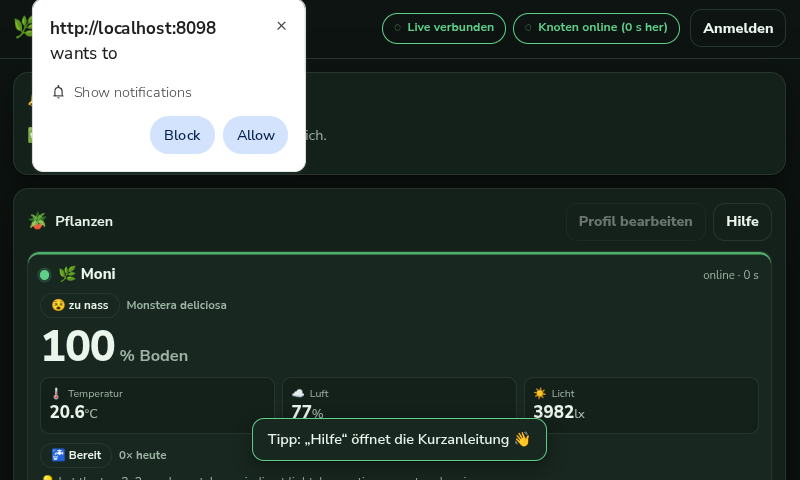
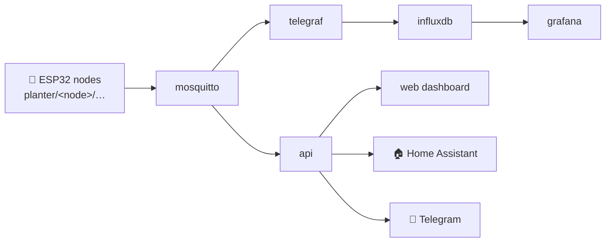

# 🌿 FloraHome — self-hosted smart planter

**One small Pi watches every plant individually** — waters each on its own terms,
keeps a history you own, shouts when something is wrong, and plugs straight into
**Home Assistant**. Runs entirely on hardware you own: no cloud, no vendor
account.



> **New here?** Start with [`docs/TUTORIALS.md`](docs/TUTORIALS.md).
> How it all fits together: [`docs/ARCHITECTURE.md`](docs/ARCHITECTURE.md)
> (with diagrams). Real Pi + ESP32 deployment log:
> [`DEPLOYMENT_HANDOFF.md`](DEPLOYMENT_HANDOFF.md). Breadboard wiring, one sensor
> at a time: [`docs/WIRING_FOR_DUMMIES.md`](docs/WIRING_FOR_DUMMIES.md).

---

## Why it's different

- **Per-plant, not per-planter.** Each node has its own MQTT namespace
  (`planter/<node>/…`), its own rules, alerts, history and Home Assistant device.
  A dose to one plant can never water another.
- **The plant is safe even if the Pi dies.** The pump relay is forced off on boot
  and every dose is clamped to 45 s **in firmware** — the Pi only decides *when*.
- **Comfort on the Pi.** Auto-watering, cooldowns, daily caps, Telegram alerts,
  audit trail, history in InfluxDB, Grafana.
- **Moodboard.** Give each plant a species from the built-in catalog (Monstera,
  Snake Plant, Calathea…) and it gets a nickname, an avatar, and a live *mood*
  derived from how its readings compare to that species' care range.
- **Usable from the screen.** A 5" panel on the Pi runs the dashboard full screen,
  with a plant profile editor, a settings panel, an in-app tutorial, and a
  **flash-a-new-ESP** panel. Easter eggs included. 🥚
- **Home Assistant native.** MQTT discovery creates one HA device per plant with
  sensors and control buttons — no custom component. [`docs/HOMEASSISTANT.md`](docs/HOMEASSISTANT.md)

---

## What's in the box

| Container | Role | Port |
|---|---|---|
| `planter-mosquitto` | MQTT broker, authenticated | 1883 |
| `planter-influxdb` | time-series history | 8086 |
| `planter-telegraf` | MQTT → InfluxDB writer (`planter/+/telemetry`) | – |
| `planter-api` | per-node rules, alerts, audit, history, plants, SSE | 8097 |
| `planter-web` | dashboard + reverse proxy (nginx) | 8098 |
| `planter-grafana` | bonus: stock Grafana dashboard | 3030 |
| `planter-esphome` | optional (tools): build + OTA the nodes from a browser | 6052 |
| `planter-flasher` | optional (tools): detect + flash ESPs over USB | 6053 |

Data path: **ESP32 → MQTT → { Telegraf → InfluxDB → Grafana }** and
**→ API → SSE → dashboard**, plus **→ Home Assistant** via retained discovery.

---

## Start here

```bash
cd ~/smartplanter
cp .env.example .env  &&  nano .env      # fill in the CHANGE_ME values
./scripts/start.sh                        # builds, starts, smoke-tests, prints URLs
sudo chown -R 1000:1000 data              # once: Docker creates data/ as root
docker compose up -d --force-recreate api
```

| | URL |
|---|---|
| Dashboard | http://&lt;host&gt;:8098 |
| API docs / state | http://&lt;host&gt;:8097/docs · `/api/state` |
| Grafana | http://&lt;host&gt;:3030 |
| ESPHome (tools) | http://&lt;host&gt;:6052 |

### Add a plant (one command per node)

```bash
deploy/add-node.sh new plant-b "My Snake Plant"   # esphome/plant-b.yaml
deploy/add-node.sh discover                        # which ESP is on which port
deploy/add-node.sh compile plant-b
deploy/add-node.sh flash  plant-b /dev/ttyUSB0     # first time: USB
deploy/add-node.sh ota    plant-b 10.42.0.x        # ever after: OTA
```

Then give it a species/avatar in the dashboard (**Profil bearbeiten**).

---

## How the pieces fit



Full diagrams (system, data flow, HA, GPIO, topology, DB): rendered SVGs in
[`docs/diagrams/`](docs/diagrams/), sources in
[`docs/ARCHITECTURE.md`](docs/ARCHITECTURE.md).

---

## MQTT topics (per node)

| Topic | Direction | Payload |
|---|---|---|
| `planter/<node>/telemetry` | node → hub | JSON every 10 s |
| `planter/<node>/status` | node → hub | `online` / `offline` (LWT) |
| `planter/<node>/event` | node → hub | `{"event":"button_water_now"}` |
| `planter/<node>/cmd` | hub → node | `{"action":"pump\|light\|buzzer\|stop\|cal",…}` |
| `planter/<node>/estop` | hub → node | `{"estop":true\|false}` retained |
| `planter/<node>/state/<field>` | hub → HA | retained per-field state |

Full reference + migration from the old single-topic scheme:
[`docs/MQTT.md`](docs/MQTT.md).

Telemetry payload:

```json
{"device":"plant-a","fw":"1.2.0","ts":1790626773,
 "moisture_pct":19.4,"soil_v":2.64,"temp_c":21.6,"humidity":57,"lux":8300,
 "tank_pct":78,"rssi":-58,"pump":"idle","light":"off","mode":"auto","fault":"ok"}
```

---

## Safety design (the bit that matters)

- **The ESP32 enforces safety.** Pump relay `ALWAYS_OFF` on boot, pump script
  `mode: single`, run time clamped to `pump_max_seconds` (45 s) in firmware.
  **If the Pi dies mid-watering the relay still opens.**
- **The Pi provides comfort.** When to water, when to shout, what to log.

Failure mode of a crashed Pi: *the plant goes thirsty*, never *the plant drowns*.

Guards: per-node cooldown, daily cap, tank-low block, dry-soil alert that
re-raises until moisture rises. Rules and tuning: [`docs/ALERTS.md`](docs/ALERTS.md).

---

## The dashboard

- Dark, green, touch-first; fits the Pi's 800×480 panel (kiosk autostarts).
- **Pflanzen**: a moodboard card per node — species, avatar, mood, big soil %,
  temperature, air humidity, light, pump state.
- **Einstellungen**: watering, alerts, Telegram, grow-light automation.
- **Kalibrierung**: soil dry/wet from the live raw voltage (sent to the node,
  persisted, no reflash).
- **Geräte & Flashen**: see attached ESPs and flash a node from the screen.
- **Hilfe**: an in-app quick tutorial.
- Easter eggs: tap the 🌿 logo three times, or try Konami. 🎉

---

## Security

- Dashboard is **read-only until login**; every `PUT`/`POST` needs an
  HMAC-signed session cookie (12 h).
- Login rate-limited (10 failures/IP → 5-min lockout).
- Every config change, command, login, failure, alert and flash is written to the
  `audit` table with actor + IP + timestamp.
- Anonymous Grafana is **Viewer only**.
- Secrets (`esphome/secrets.yaml`, `.env`, `data/`) are gitignored; compiled
  firmware contains Wi-Fi/MQTT passwords and is never committed.

---

## Troubleshooting

| Symptom | Cause / fix |
|---|---|
| `unable to open database file` | `./data` not writable by `PUID`; `sudo chown -R 1000:1000 data` |
| Mosquitto restart-looping, `Unable to open pwfile` | `docker compose down && docker volume rm smartplanter_mqtt-data && docker compose up -d` |
| Telegraf `no such host mosquitto` | started before the broker; `docker compose restart telegraf` |
| Pump runs at boot | relay is active-LOW → `relay_inverted: "true"` + 10 kΩ pull-down on GPIO26 |
| Moisture always 0 %/100 % | uncalibrated, or sensor on an ADC2 pin (must be **ADC1**) |
| Node shows as `offline` / unseen | it is not on `FloraHome`; check `wlan0` AP and `esphome/secrets.yaml` |
| OTA fails | node is not on the Pi's L2; first flash must be USB |
| Touch drag scrolls the wrong way | absolute-mouse panel — see `docs/PI_DISPLAY.md` |

---

## Deployment

The stack is portable: it runs identically on a devbox and on the Pi. On the Pi,
the nodes join the Pi's own **`FloraHome`** 2.4 GHz hotspot, so they land on the
broker's L2 and **OTA works**. See
[`docs/DEVICES.md`](docs/DEVICES.md) (devices, flashing, hotspot) and
[`DEPLOYMENT_HANDOFF.md`](DEPLOYMENT_HANDOFF.md) (the real deployment, traps and
SD-card cloning).

Every service is `restart: unless-stopped`, so the whole rig comes back by itself
after a power cut.
