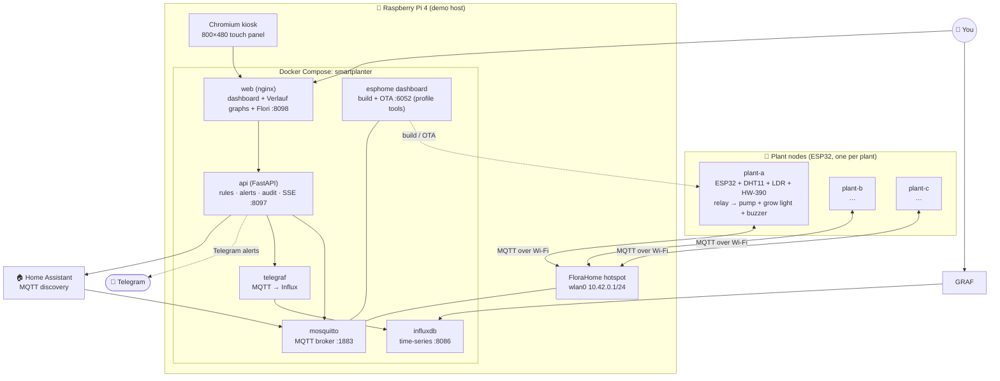
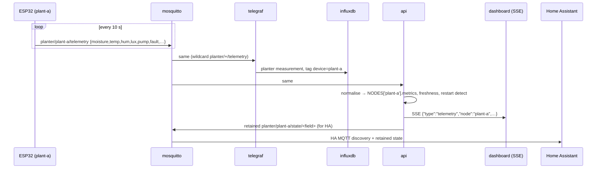
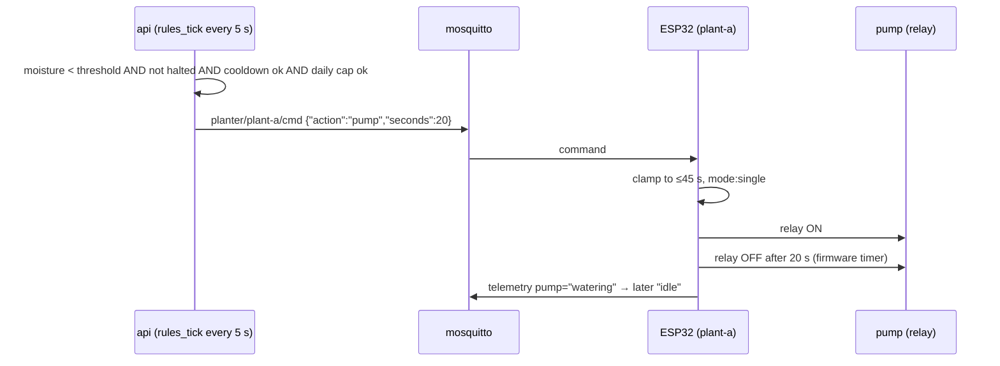
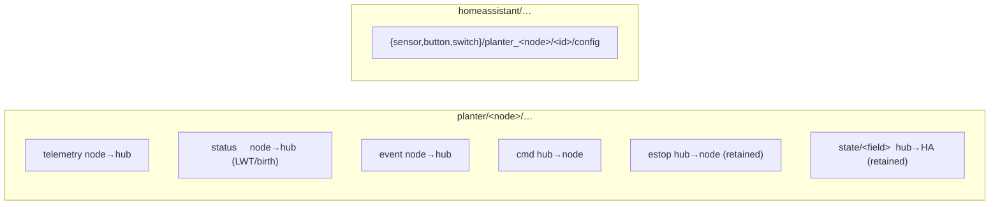
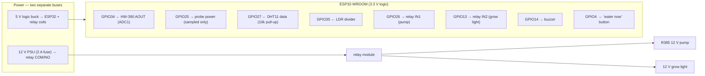
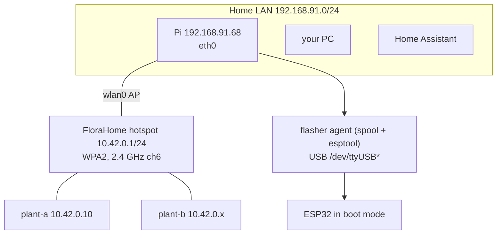
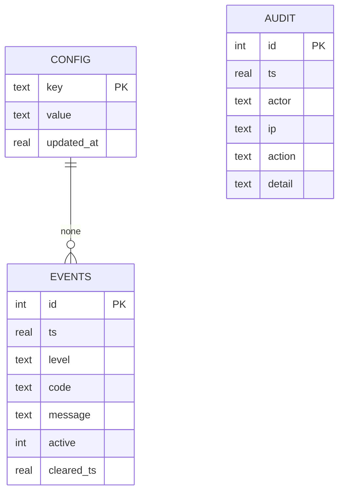

# FloraHome — Architecture

> **Value proposition.** FloraHome turns a cheap ESP32 + a capacitive soil probe
> into a *self-hosted, cloud-free smart planter* that watches **each plant
> individually**, waters it on its own terms, keeps a history you own, alerts you
> when something is wrong, and plugs straight into **Home Assistant**. The
> firmware enforces the safety (never flood a plant, never run a pump dry); the
> Pi provides the comfort (when to water, when to shout, what to log). One Pi
> hosts many plants; adding a plant is one command.

Everything below runs on hardware you own. No vendor account, no cloud.

---

## 1. System overview



**Why it is safe.** The ESP32 holds the authority: the pump relay is forced off
on boot, a dose is clamped to `pump_max_seconds` (45 s) *in firmware*, and a
second command cannot extend a running dose (`mode: single`). If the Pi dies
mid-watering the relay still opens. The Pi's failure mode is "the plant goes
thirsty", never "the plant drowns".

---

## 2. Service map

| Container | Image | Role | Port |
|---|---|---|---|
| `planter-mosquitto` | eclipse-mosquitto:2 | authenticated MQTT broker; one namespace per node | 1883 |
| `planter-influxdb` | influxdb:2.7 | time-series history (30 d) | 8086 |
| `planter-telegraf` | telegraf:1.32-alpine | subscribes `planter/+/telemetry`, writes Influx | – |
| `planter-api` | built from `api/` | per-node rules, alerts, audit, history, SSE | 8097 |
| `planter-web` | nginx:1.27-alpine | dashboard + Verlauf graphs + `/api` reverse proxy | 8098 |
| `planter-esphome` | esphome/esphome:2025.8 | build + **OTA-flash** nodes from a browser | 6052 |

Start the optional ESPHome dashboard with `docker compose --profile tools up -d`.

---

## 3. Data flows

### 3.1 Telemetry (node → hub)



### 3.2 Watering decision (hub → node)



The **same path** is used by the dashboard's "Jetzt bewässern" button, the Home
Assistant button, and the physical "Wasser jetzt" button (which calls the local
script directly and publishes `…/event`).

### 3.3 Alerts

The Pi raises alerts it can only know centrally — `node_silent`, `soil_dry`,
`tank_empty`, `sensor_fault` — per node (codes are prefixed `plant-a:`), opens an
`events` row, writes the `audit` log, pushes an SSE event, and sends Telegram
(10-minute anti-spam per code). The node's own buzzer only covers what the node
can still see. See [ALERTS.md](ALERTS.md).

---

## 4. MQTT topic namespace (multi-node safe)



Because every node has its **own** `cmd`/`estop` topic, a command to `plant-a`
can never water `plant-b`. This is the fix for the original single-topic design
that made a second plant unsafe. The API subscribes with wildcards
(`planter/+/telemetry`, `planter/+/status`) and derives the node name from the
topic. Full table: [MQTT.md](MQTT.md).

---

## 5. Hardware per node



Rules that are non-negotiable (see [WIRING_FOR_DUMMIES.md](WIRING_FOR_DUMMIES.md)):
logic and 12 V are separate rails tied at one point; the relay coil is driven by
the module/transistor, never a GPIO; a 10 kΩ pull-down on GPIO26 stops boot
chatter; GPIO34 is **ADC1** (ADC2 is dead while Wi-Fi is on).

---

## 6. Deployment topology



The Pi is the **access point** for the nodes: they join `FloraHome`, so they are
on the same L2 as the broker and **OTA works** (port 3232). The Pi's own services
are reachable from the LAN. See [DEPLOYMENT_HANDOFF.md](../DEPLOYMENT_HANDOFF.md).

---

## 7. Home Assistant integration

The API publishes, per node, retained clarity topics under
`homeassistant/{sensor,button,switch}/planter_<node>/…`, so HA discovers **one
device per plant** with sensors (moisture, temperature, humidity, light, RSSI,
pump state, uptime) plus controls:

- **Button** "Jetzt bewässern" → `planter/<node>/cmd`
- **Button** "Buzzer testen"
- **Switch** "Grow Light" → `planter/<node>/cmd`

Point your HA MQTT integration at the broker and the devices appear. Details and
a YAML fallback: [HOMEASSISTANT.md](HOMEASSISTANT.md).

---

## 8. Storage & data model



- **SQLite** (`data/planter.db`) — runtime config, alert events, audit trail.
- **InfluxDB** — numeric history, one `planter` measurement tagged `device`.
- **In-memory** — last known state per node + a bounded fallback history.

Every write (login, config change, manual command, alert raise/clear) is written
to `audit` with actor + IP + timestamp.

---

## 9. Security model

- Dashboard is **read-only until login**; every `PUT`/`POST` needs an
  HMAC-signed session cookie (12 h).
- Login is rate-limited (10 failures from one IP → 5-minute lockout).
- API keys are stored masked; they can be rotated from the Backend tab and apply
  without a restart. The history graphs are rendered by the dashboard itself, so
  no separate Grafana container is shipped any more.
- Secrets (`esphome/secrets.yaml`, `.env`, `data/`) are gitignored; compiled
  firmware contains Wi-Fi/MQTT passwords and is never committed.

---

## 10. Adding a plant

```bash
deploy/add-node.sh new plant-d "My Monstera"     # create esphome/plant-d.yaml
deploy/add-node.sh discover                     # which ESP is on which port
deploy/add-node.sh compile plant-d
deploy/add-node.sh flash  plant-d /dev/ttyUSB0  # first time: USB
# after it joined FloraHome:
deploy/add-node.sh ota    plant-d 10.42.0.x     # ever after: OTA
```

Then give it a profile (species, avatar, care thresholds) in the dashboard's
**Pflanzen** settings. Full tutorial: [TUTORIALS.md](TUTORIALS.md).

---

## 11. Diagrams

The Mermaid blocks above render on GitHub. Rendered **SVG** copies live in
[`diagrams/`](diagrams/) and are regenerated with
`python3 scripts/render_diagrams.py` (uses mermaid.ink, no local toolchain).
